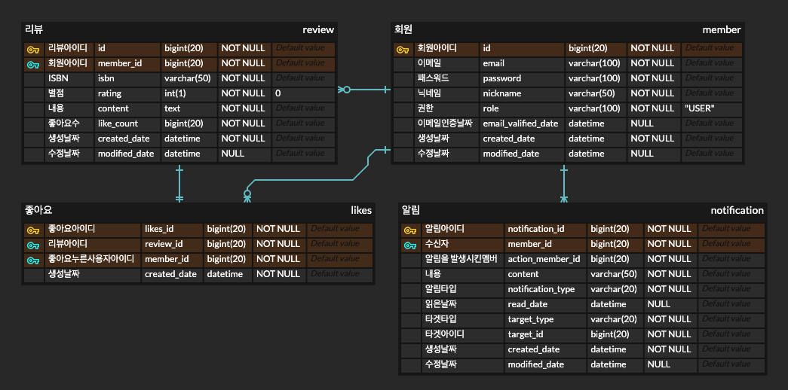

# 책 리뷰 서비스

책을 리뷰하고 조회할 수 있는 서비스입니다.

## 프로젝트 기능 및 설계
- 회원가입
    - 사용자는 회원가입을 할 수 있다.
    - 이메일, 패스워드, 닉네임(8자 이내)을 입력받으며, 이메일과 닉네임은 unique 해야한다. 모든 값은 필수값이다.
    - 이메일 인증의 경우 72시간내에 수행해야한다.
    - 모든 사용자는 회원가입 시 USER 권한을 갖는다.
        - ADMIN role도 있지만, 관리자 회원가입은 별도의 API는 제공하지 않는다.

- 로그인
    - 사용자는 로그인을 할 수 있다.
    - 이메일 인증이 된 이메일로만 로그인이 가능하다.
    - 로그인 시 회원가입 때 사용한 아이디와 패스워드가 일치해야한다.
    - 스프링 시큐리티와 JWT를 사용하고, 로그인에 성공하면 JWT를 발급한다.

- 책 검색
    - 로그인하지 않은 사용자를 포함한 모든 사용자는 책을 검색할 수 있다. '네이버 검색 > 책 Search API'를 사용한다. https://developers.naver.com/docs/serviceapi/search/book/book.md#%EC%B1%85
    - 네이버 API 호출 장애 발생 시 '서킷 브레이커 패턴'을 사용한다.(e.g. 카카오 책 검색하기 API: https://developers.kakao.com/docs/latest/ko/daum-search/dev-guide#search-book)
    - 검색 결과는 기본적으로 '정확도 순'으로 정렬되며, 그 외 정렬으로는 '최근 출간일 순'이 있다.
    - 책 이미지, 제목, 저자, 판매가격, 출판사, 출간일을 볼 수 있고, 검색 결과가 많을 수 있으므로 paging 처리한다.

- 책 상세 조회
    - 로그인하지 않은 사용자를 포함한 모든 사용자는 책을 상세 조회할 수 있다.
    - 책 이미지, 제목, 저자, 판매가격, 출판사, 출간일 외에도 ISBN, 책 소개, 책 리뷰 리스트를 볼 수 있다.

- 책 리뷰 리스트 조회
    - 리뷰의 구성은 작성자의 닉네임, 별점, 내용, 좋아요 갯수, 작성 날짜로 구성된다.
    - '좋아요순', '최신 순'으로 정렬할 수 있다.
    - 결과가 많을 수 있으므로 paging 처리한다.

- 책 리뷰 작성
    - 로그인한 사용자만 리뷰를 작성할 수 있다.
    - 리뷰 작성 항목은 작성자의 닉네임, 별점, 내용으로 구성되고 모두 필수값이다.
    - 책을 따로 DB에 저장하지 않으므로, ISBN값을 사용한다.

- 본인이 작성한 리뷰 리스트 조회
    - 로그인한 사용자가 리뷰를 작성하면, 본인이 작성한 리뷰들을 모아서 볼 수 있다.
    - 최근에 작성한 리뷰를 기준으로 정렬된다.

- 리뷰 '좋아요'
    - 로그인한 사용자만 마음에 드는 리뷰에 '좋아요'를 누를 수 있다.
    - 회원의 중복 '좋아요'를 방지하기 위해 회원ID, 리뷰ID를 unique로 가진다.
    - 리뷰 작성자는 '좋아요 알림'을 받는다.
        - 단, '좋아요'를 누른 뒤 5초 내에 취소하면 알림은 발생하지 않는다.

- 리뷰 '좋아요' 취소
    - 로그인한 사용자는 본인이 누른 '좋아요'를 취소할 수 있다.
    - 리뷰 작성자는 취소알림은 받지 않는다.
    - '좋아요' 테이블에서 삭제된다.

- 알림
    - 로그인한 사용자만 알림을 받아볼 수 있다.
    - 알림은 수신자, 내용, 알림이 온 날짜, 읽은 상태로 구성되어있다.
    - 읽은 상태는 읽은날짜 컬럼을 둠으로써 구현한다.
    - 알림이 무슨 타입인지 파악하기위해 enum으로 관리한다. (e.g. LIKE, COMMENT)
        - 현재는 '좋아요'타입의 알림만 존재하지만, 추후에 여러 타입의 알림이 추가될 가능성이 있기때문이다.
    - 알림은 [내가 작성한 리뷰에 '좋아요'가 눌렸을 때]와 같은 상황에 발생한다.
    - 만약, [A유저가 사용자님의 '리뷰1'를 좋아합니다.] 라는 알림이 온다면, 해당 알림 클릭 시 '리뷰1'로 이동한다.
        - A유저: action_member_id 컬럼을 둠으로써 구현한다.
        - 리뷰1로 이동: target_type 컬럼과 target_id 컬럼을 둠으로써 구현한다.

## ERD
 

## Trouble Shooting
[go to the trouble shooting section](doc/TROUBLE_SHOOTING.md)

### Tech Stack

 
   
   
   
  

